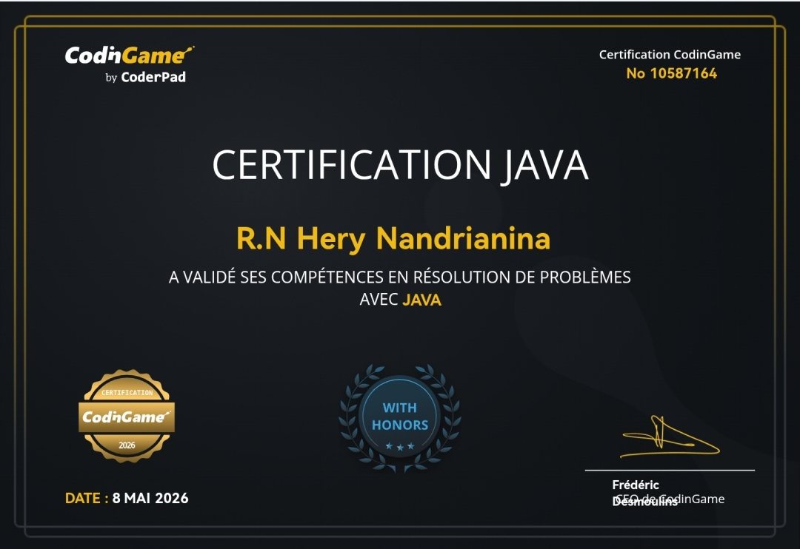
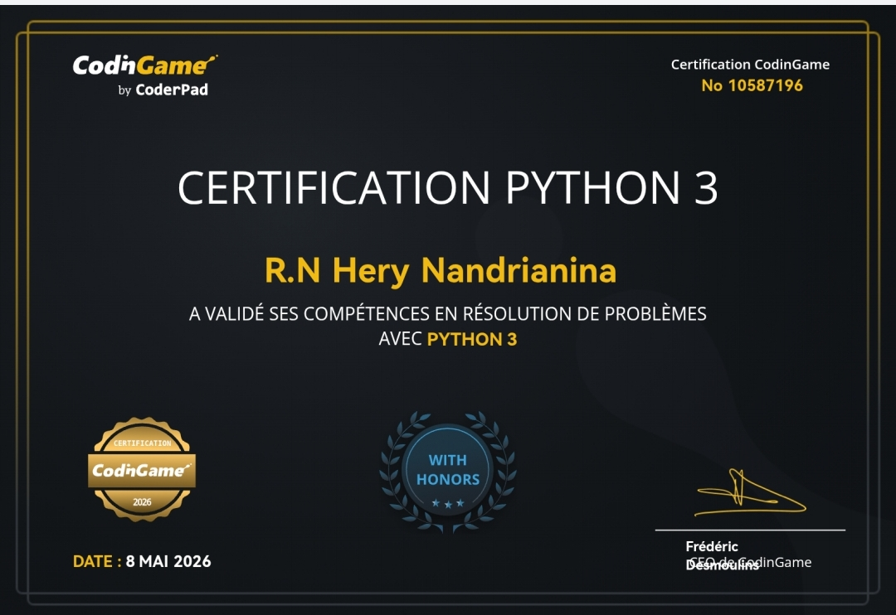
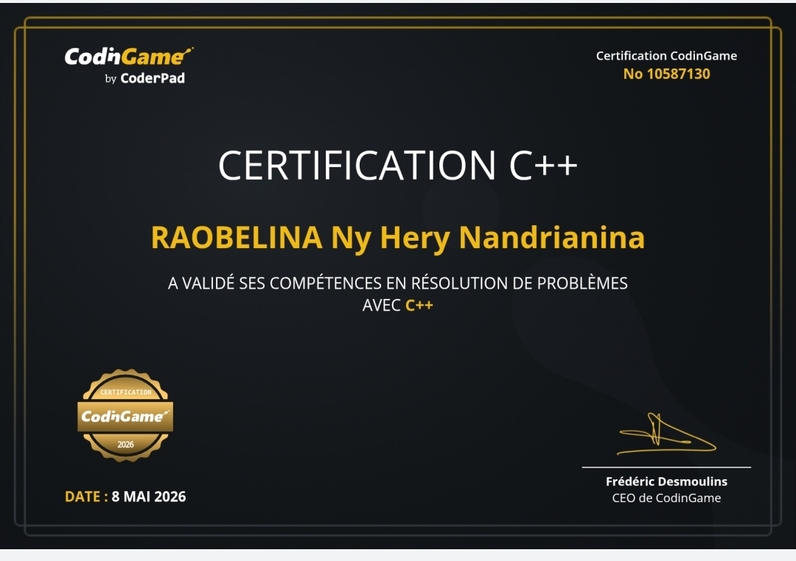

<!-- HEADER TERMINAL ANIMÉ -->

  

 

<!-- TYPING ANIMATION -->
<h2 align="center">
  
</h2>

---
##  Activité (animation)

  

  
                           LANGAGE DE PROGRAMMATION & OUTILS (IDE, etc.) 

 

  

##  À propos

1) Développeur junior passionné 
2) Flutter & développement mobile 
3) Backend : Java / Spring Boot 
4) Apprentissage continu & progression constante

<h2 align="center"> MES CERTIFICATIONS et ATTESTATIONS </h2>

<table align="center">
<tr>

<td align="center">
    
  
  <a href="https://www.codingame.com/certification/vxGcXEjMkEVTzwTahDxTjg" target="_blank">
     Certification Java
  </a>
</td>

<td align="center">
      
  
  <a href="" target="_blank">
     IT
  </a>
</td>

<td align="center">
    
  
  <a href="https://www.codingame.com/certification/6bdyCXQ8k1OnvUZGHTv14g" target="_blank">
     Certification Python
  </a>
</td>

<td align="center">
      
  
  <a href="" target="_blank">
     git/github 
  </a>
</td>

<td align="center">
      
  
  <a href="" target="_blank">
     JAVA (Basic) 
  </a>
</td>

<td align="center">
      
  
  <a href="" target="_blank">
     UI UX
  </a>
</td>

<td align="center">
      
  
  <a href="" target="_blank">
     SE Linux
  </a>
</td>

<td align="center">
      
  
  
</td>

<td align="center">
    
  
  <a href="https://www.codingame.com/certification/2Ssp_y8_1vCc02DnnNbtDQ" target="_blank">
     Certification C++ 
  </a>
</td>

</tr>
</table>

## AI System Dashboard en Temps REEL @GITHUB

<table align="center">
<tr>
<td align="center" width="50%">

<!-- LEFT : AI SYSTEM -->

 

</td>

<td align="center" width="50%">

<!-- RIGHT : ABOUT -->
<h3> A PROPOS </h3>

 

</td>
</tr>
</table>

---

---

<h2 align="center"> MES CHAÎNES DEV PRÉFÉRÉES </h2>

  

  
  
  

  
  
  

---

  

<!-- FOOTER CYBER TERMINAL -->

  

